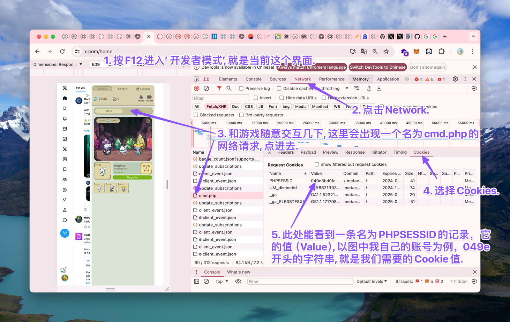

# xMetaCene-Auto

## 简介
本项目是区块链游戏xMetaCene的自动化脚本，当前可以实现以下过程的自动化操作：
1. 唤醒pet
2. pet升级
3. roleMan解锁
4. roleMan、roleWoman 升级
5. 给roleMan、roleWoman喂电池
6. 大炮充能
7. 完成每日签到获得电池和钻石
8. 每小时自动开宝箱
9. 自动将积分兑换成代币

**关于xMetaCene**

💎 官推：[@xMetacene_](https://x.com/xMetacene_)

💎 如何参与：
1. 下载安装游戏插件：https://chromewebstore.google.com/detail/xmetacene/igimfdmnnijclcfdgimooedbealfpndj
2. 打开twitter，插件会在屏幕右侧自动弹出，点击用twitter登陆（Login with Twitter），输入邀请码（我的邀请码：vuX4Nafi0v）即可开始玩。

💎 游戏规则大致如下：
1. 挂机获得钻石，钻石可以用来升级pet。
2. 完成分享任务，绑定钱包可以获得额外的钻石和解锁新pet
3. pet能不断产出钻石，pet等级越高，产出速度越快。
4. pet每12小时需要手动唤醒，不然就会睡大觉💤，睡觉期间不会有钻石产出。
5. 钻石可以用来给大炮充能，每天早上7点根据所有用户的充能钻石数量，瓜分 $TMAK 奖励。
6. 每小时可以开宝箱，开宝箱能获得4小时的钻石产出，小概率能获得50 $MNT, 这个过程要和Mantle上的合约交互，算了下1u的gas大概能开80次宝箱。


## 使用说明

### 环境依赖
```shell
pip install requests
pip install web3
```

### 配置文件
项目目录下的`example.config.py`是一个示例配置文件，该配置文件需重命名为`config.py`才能生效。
下面分别对各个配置项进行说明：

**1. RPC**

配置文件第一行是RPC地址，需要填写一个Mantle节点的RPC地址，我使用的是QuickNode的节点，免费套餐足够个人使用。
该配置不是必须的，如果你不想自动化进行开宝箱、每日签到等涉及链上的相关操作，可以不填写该配置项。

**2. USER_INFO**

USER_INFO是存储账号信息的地方，如示例配置文件中的内容所示，USER_INFO是一个列表，其中，每一行也是一个列表，表示一条用户信息。
每条用户信息包含4个元素，从左向右依次是：`标识符`、`Cookie`、`钱包地址`、`私钥`

其中，`标识符`是一个字符串，用于标识用户，可以随意填写，该字段存在的意义是方便输出日志时区分不同用户的操作记录；

`钱包地址`和`私钥`是用户在Mantle上的钱包地址，该地址需要在游戏中与游戏账号绑定。

⚠️ 注意：如果您担心钱包安全问题，可以直接不填写`钱包地址`和`私钥`字段，脚本会自动识别，不进行与链上相关的操作。

`Cookie`可以理解为一个令牌，有了它脚本就可以以用户的身份进行游戏中的各种操作。获取游戏Cookie的方法如下图所示：


## 运行

在配置文件`config.py`填写完毕后，可以直接运行`main.py`文件。
```shell
python main.py
```

## 邀请码
该游戏是邀请制，如果该项目对您有所帮助，欢迎使用我的邀请码：`vuX4Nafi0v`